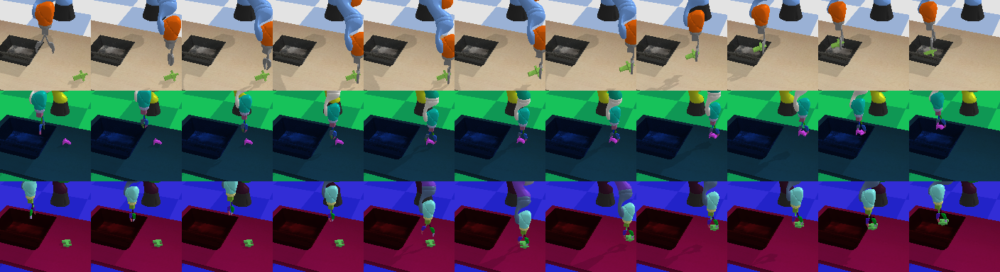
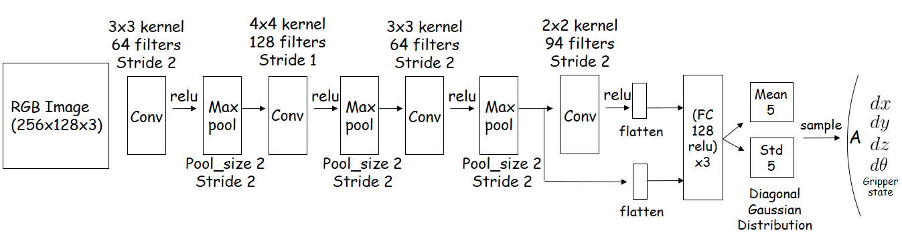
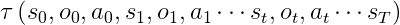
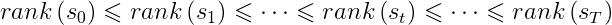
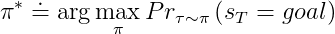
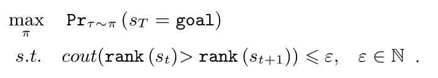
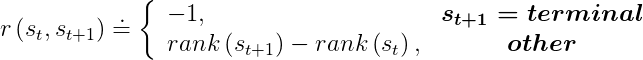

# Rank TD: End-to-End Robotic Reinforcement Learning without Reward Engineering and Demonstrations

 - [README_English](./readme_En.md) 
 - [README_Japanese](./readme_Jp.md)


实验简述
============





我们设计了一个机械臂的Pick and Place任务，机械臂抓住一个物体并把它放进框子里。


在训练阶段，使用90个形状，大小，颜色各不相同的物体, 并随机化场景渲染，照相机位置，机器人基底坐标系位置。

在测试阶段，使用10个训练阶段未见过的物体，固定照相机和机器人基底坐标系位置。


在这个机械臂只能通过两台照相机（一个在机械臂右上方，一个在机械臂肩膀部位）感知外界。通过不断与环境交互，试错。找到完成任务的方法。有意思的是，不同于传统强化学习(RL)任务需要有一个复杂的报酬函数，也不像模仿学习(IL)需要大量教示样本(S, A)。我们仅仅需要提前尽可能规定好机械臂要完成任务大致走一条什么样的状态序列（由模拟器内部状态定义）。 智能体便会follow我们预先设计好的路线探索下去。


我们的测试成功率为80%


详细内容请[点击这里](./doc/robomech_RM20-0006.pdf)


系统要求
============

- 本项目在 Ubuntu 18.04 上完成，Ubuntu 16.04 上运行应该也没问题。
- Python 版本 3.6+

安装
============

    git clone https://github.com/hyc6668378/RankTD_Kuka_Grasp.git
    cd RankTD_Kuka_Grasp
	
	#为了防止弄乱自己的python包版本，推荐在虚拟python环境下跑demo。
	
	pip3  install virtualenv
	virtualenv -p /usr/bin/python3.6 RankTD_PY36_env
	source RankTD_PY36_env/bin/activate
	
	pip install -r requirements.txt


Demo
============

我们训练好了一个模型，计算图和权重固化在`"model/Rank_TD.pd"`里。

```shell
python demo.py 
```
训练
============
我们采用的算法是PPO，用利用多线程加速roll-out效率。默认超参数参见`train.py`中`PPO`初始化参数表。

如果希望自己接着训练：

```shell
python train.py  
# 从零开始练, 还是从已有模型接着练 记得稍稍看一下内容。
```

```shell
choose_best_model.py
# 从已经训练的n多个模型中，评估一个最好的
```


```shell
froze_model_to_pd.py
# 练到满意时候，就把模型固定下来。
```


方法简介
============

机器人强化学习(模仿学习)领域有两个难点：

1. 复杂而繁琐的报酬函数设计。
2. 需要大量教师示范样本去初始化策略，或者直接克隆示范行为。

RL与IL结合的一个重要原因是希望引入先验知识，减少agent的探索空间。然而，IL也过度定义了游戏规则，限制了agent的创造力。这个项目的目的是，讨论是否有一种方法，可以在agent的创造性与先验专家知识的博弈之间找到一个平衡。

为了让agent按照专家轨迹进行探索，我们巧用了一种称为Rank差分(RankTD)的技术：

 - 定义一从状态空间到非负整数的映射 S-> N.
 - 我们希望agent能学到一个策略pi. 
   当agent沿着这个策略走出一条路径时, 这条路径所对应的秩也是单调递增的。



 -  与传统强化学习对最优策略的定义pi*有所不同。在这种有目标导向的强化学习任务下，最优策略的定义为能让路径的最终状态是goal状态概率最大的策略。



 -  所以这个问题可以模型为这样一个优化问题，在尽量满足逆序秩小于某个阈值的约束下，最大化路径终点为goal状态的概率。

 -  我们仍然几乎可以使用任何无模型强化学习算法（策略熵最大RL算法除外）去解决这个优化问题，只需要将报酬函数改为前后状态Rank的差分值。但是，如果agent遇到 1)非成功终止条件，2)逆序秩超过规定阈值时。则会收到一个-1的惩罚，然后结束整个回合。



Citing Us
------------------
如果你感觉这项工作还算不错。欢迎引用我们的[`论文`](./doc/robomech_RM20-0006.pdf):

```
@article{RankTD,
    author = {ShengKai Huang},
    title = {Rank TD: End-to-End Robotic Reinforcement Learning without Reward Engineering and Demonstrations},
    year = {2020}
}
```
